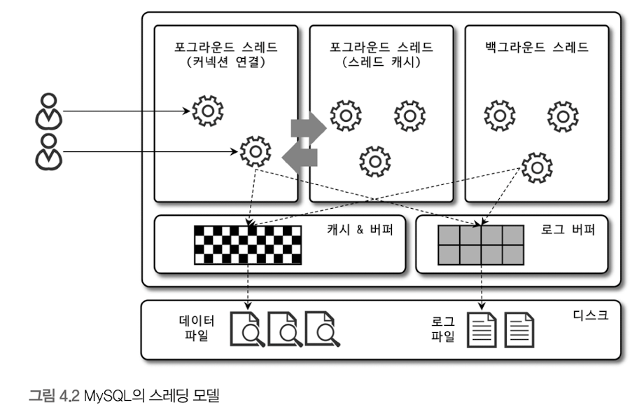

# 4.1 MySQL 엔진 아키텍처

MySQL 서버는 다른 DBMS에 비해 구조가 독특

독특한 구조는 장점이 되거나, 단점이 될 수 있음 
- 같은 상황이더라도, 다른 결과나 문제가 발생 가능

## 4.1.1 MySQL 전체 구조


- [MySQL 18.11 Overview of MySQL Storage Engine Architecture](https://dev.mysql.com/doc/refman/8.4/en/pluggable-storage-overview.html)

MySQL은 프로그래밍 언어에서 접근 방법을 모두 지원
- JDBC, ODBC 등 드라이버를 사용한 방법으로, 모든 언어로 쿼리를 사용할 수 있도록 지원

MySQL 서버는 크게 `MySQL 엔진`과 `스토리지 엔진`으로 구분

### 4.1.1.1 MySQL 엔진

MySQL 엔진
- 커넥션 핸들러: 클라이언트 접속, 쿼리 요청 처리
- SQL 파서
- SQL 옵티마이저: 파싱된 쿼리를 최적화

### 4.1.1.2 스토리지 엔진

MySQL 엔진 = 요청된 SQL 문장을 분석하거나 최적화
- DBMS의 두뇌에 해당하는 처리 수행

스토리지 엔진 = 실제 데이터를 읽고 쓰는 역할을 전담
- 여러 스토리지 엔진을 사용 가능

```mysql
CREATE TABLE test_table (fd1 INT, fd2 INT) ENGINE=INNODB;
```

위 예제에서, `InnoDB` 스토리지 엔진 사용하도록 정의


### 4.1.1.3 핸들러 API

데이터를 읽고 쓸 때, 스토리지 엔진에 요청을 하는데, 이를 `핸들러(Handler)` 요청이라 함

이 때 사용되는 API는 핸들러 API라 부름

핸들러 API를 통해, 얼마나 많은 데이터(레코드) 작업이 있었는지 확인 가능

```mysql
SHOW GLOBAL STATUS LIKE 'Handler%';
```

```text
+--------------------------+-----+
|Variable_name             |Value|
+--------------------------+-----+
|Handler_commit            |681  |
|Handler_delete            |8    |
|Handler_discover          |0    |
|Handler_external_lock     |6667 |
|Handler_mrr_init          |0    |
|Handler_prepare           |0    |
|Handler_read_first        |41   |
|Handler_read_key          |1818 |
|Handler_read_last         |0    |
|Handler_read_next         |4209 |
|Handler_read_prev         |0    |
|Handler_read_rnd          |0    |
|Handler_read_rnd_next     |813  |
|Handler_rollback          |0    |
|Handler_savepoint         |0    |
|Handler_savepoint_rollback|0    |
|Handler_update            |331  |
|Handler_write             |8    |
+--------------------------+-----+
```

## 4.1.2 MySQL 스레딩 구조


- [MySQL Connection Handling and Scaling](https://dev.mysql.com/blog-archive/mysql-connection-handling-and-scaling/)
  - MySQL 커넥션과 관련된 Thread 동작 내용 설명
  - 가용 가능한 User Thread와, Connection은 특정 지점을 넘으면 효율 감소
    - Core 48개 기준으로 128 Connection일 때 최대 효율 (최대 효율의 Thread Per Connection = 2.7)
  - 대략적으로 `CPU Core * 4`개의 User Thread 설정을 권장
  - 병렬 처리의 병목은 아래 현상으로도 발생 가능
    - Mutex
    - Database Lock
    - Network IO, Disk IO

MySQL 서버는 프로세스 기반이 아닌, 스레드 기반으로 동작
- 구체적으로는 `one-thread-per-connection` 방식으로, OS에서 생성해준 Thread를 기본으로 사용
- `one-thread-per-connection`은 Enterprise Edition에서는 Thread Pool 방식으로 변경 가능
  - [The New MySQL Thread Pool](https://dev.mysql.com/blog-archive/the-new-mysql-thread-pool/)
  - 스레드 풀의 관한 내용은 `4.1.9절 스레드 풀` 참고

현재 실행 중인 스레드 목록은 다음과 같이 확인 가능
```text
+---------+-------------------------------------------+----------+----------------+----------------+
|thread_id|name                                       |type      |processlist_user|processlist_host|
+---------+-------------------------------------------+----------+----------------+----------------+
|1        |thread/sql/main                            |BACKGROUND|null            |null            |
|2        |thread/mysys/thread_timer_notifier         |BACKGROUND|null            |null            |
|4        |thread/innodb/io_ibuf_thread               |BACKGROUND|null            |null            |
|5        |thread/innodb/io_read_thread               |BACKGROUND|null            |null            |
|6        |thread/innodb/io_read_thread               |BACKGROUND|null            |null            |
|7        |thread/innodb/io_read_thread               |BACKGROUND|null            |null            |
|8        |thread/innodb/io_read_thread               |BACKGROUND|null            |null            |
|9        |thread/innodb/io_write_thread              |BACKGROUND|null            |null            |
|10       |thread/innodb/io_write_thread              |BACKGROUND|null            |null            |
|11       |thread/innodb/io_write_thread              |BACKGROUND|null            |null            |
|12       |thread/innodb/io_write_thread              |BACKGROUND|null            |null            |
|13       |thread/innodb/page_flush_coordinator_thread|BACKGROUND|null            |null            |
|14       |thread/innodb/log_checkpointer_thread      |BACKGROUND|null            |null            |
|15       |thread/innodb/log_flush_notifier_thread    |BACKGROUND|null            |null            |
|16       |thread/innodb/log_flusher_thread           |BACKGROUND|null            |null            |
|17       |thread/innodb/log_write_notifier_thread    |BACKGROUND|null            |null            |
|18       |thread/innodb/log_writer_thread            |BACKGROUND|null            |null            |
|19       |thread/innodb/log_files_governor_thread    |BACKGROUND|null            |null            |
|24       |thread/innodb/srv_lock_timeout_thread      |BACKGROUND|null            |null            |
|25       |thread/innodb/srv_error_monitor_thread     |BACKGROUND|null            |null            |
|26       |thread/innodb/srv_monitor_thread           |BACKGROUND|null            |null            |
|27       |thread/innodb/buf_resize_thread            |BACKGROUND|null            |null            |
|28       |thread/innodb/srv_master_thread            |BACKGROUND|null            |null            |
|29       |thread/innodb/dict_stats_thread            |BACKGROUND|null            |null            |
|30       |thread/innodb/fts_optimize_thread          |BACKGROUND|null            |null            |
|32       |thread/mysqlx/worker                       |BACKGROUND|null            |null            |
|33       |thread/mysqlx/acceptor_network             |BACKGROUND|null            |null            |
|37       |thread/innodb/buf_dump_thread              |BACKGROUND|null            |null            |
|38       |thread/innodb/clone_gtid_thread            |BACKGROUND|null            |null            |
|39       |thread/innodb/srv_purge_thread             |BACKGROUND|null            |null            |
|40       |thread/innodb/srv_worker_thread            |BACKGROUND|null            |null            |
|41       |thread/innodb/srv_worker_thread            |BACKGROUND|null            |null            |
|42       |thread/innodb/srv_worker_thread            |BACKGROUND|null            |null            |
|44       |thread/mysqlx/acceptor_network             |BACKGROUND|null            |null            |
|47       |thread/sql/con_sockets                     |BACKGROUND|null            |null            |
|49       |thread/mysqlx/worker                       |BACKGROUND|null            |null            |
|43       |thread/sql/event_scheduler                 |FOREGROUND|event_scheduler |localhost       |
|46       |thread/sql/compress_gtid_table             |FOREGROUND|null            |null            |
|52       |thread/sql/one_connection                  |FOREGROUND|root            |localhost       |
+---------+-------------------------------------------+----------+----------------+----------------+
```

- 백그라운드 스레드 갯수는 MySQL 서버 설정에 따라 가변적일 수 있음
- 동일한 이름의 스레드가 2개 이상 보이는 건 , 여러 스레드가 동일 작업을 병렬로 처리하는 경우


### 4.1.2.1 포그라운드 스레드(클라이언트 스레드)

포그라운드 스레드(Foreground Thread) 또는 사용자 스레드(User Thread)는 최소한 MySQL 서버에서 접속된 클라이언트의 수만큼 존재

주로 각 클라이언트 사용자가 요청하는 쿼리 문장을 처리

클라이언트 사용자가 작업을 마치고 커넥션을 종료하면, 해당 커넥션을 담당하던 스레드는 다시 스레드 캐시(Thread cache)로 돌아감

스레드 캐시에 일정 개수 이상의 대기 중인 스레드가 있으면 스레드 캐시에 넣지 않고 스레드를 종료시켜 일정 개수의 스레드만 스레드 캐시에 존재하도록 설정 가능
- `thread_cache_size` 시스템 변수
- 최근에는 스레드 생성이 비교적 가볍기 때문에, 별도로 설정하지 않는 경우가 있음
  - [MySQL Connection Handling and Scaling](https://dev.mysql.com/blog-archive/mysql-connection-handling-and-scaling/)

포그라운드 스레드는 데이터를 MySQL의 데이터 버퍼나 캐시로부터 가져와, 버퍼나 캐시에 없는 경우 디스크의 데이터나 인덱스 파일로부터 데이터를 읽어서 작업을 처리

- MyISAM
  - 디스크 쓰기 작업까지 포그라운드 스레드가 처리
  - 지연된 쓰기(INSERT DELAYED)가 있지만 일반적인 방식은 아님
- InnoDB
  - 데이터 버퍼나 캐시까지 포그라운드 스레드가 처리
  - 버퍼에서 디스크까지 기록하는 작업은 백그라운드 스레드가 처리

### 4.1.2.2 백그라운드 스레드

InnoDB에서 하는 작업
- 인서트 버퍼(Insert Buffer)를 병합하는 스레드
- 로그를 디스크로 기록하는 스레드
- InnoDB 버퍼 풀의 데이터를 디스크에 기록하는 스레드
- 데이터를 버퍼로 읽어 오는 스레드
- 잠금이나 데드락을 모니터링하는 스레드

- 버퍼풀 참고
  - [MySQL 17.5.1 Buffer Pool](https://dev.mysql.com/doc/refman/8.4/en/innodb-buffer-pool.html)
  - [MySQL 17.8.3.3 Making the Buffer Pool Scan Resistant](https://dev.mysql.com/doc/refman/8.4/en/innodb-performance-midpoint_insertion.html)

가장 중요한 역할
- `로그 스레드(Log thread)`
- `쓰기 스레드(Write thread)` : 데이터를 디스크로 내려쓰는 작업을 처리

InnoDB에서는 데이터 읽기의 경우, 클라이언트 스레드에서 처리되지만 쓰기 스레드의 경우 아주 많은 작업을 백그라운드로 처리

따라서 디스크를 최적으로 사용할 수 있을 만큼 충분히 설정하는 것이 좋음

사용자의 요청을 처리하는 도중 데이터의 쓰기 작업은 지연(버퍼링)되어 처리될 수 잇지만, 데이터 읽기 작업은 절대 지연될 수 없음

InnoDB는 쓰기(지연), 읽기(즉시) 처리됨

MyISAM은 사용자 스레드가 쓰기 작업도 같이 처리하도록 설계
- 이러한 이유로 MyISAM에서 일반적인 쿼리는 쓰기 버퍼링 기능을 사용할 수 없음

## 4.1.3 메모리 할당 및 사용 구조

